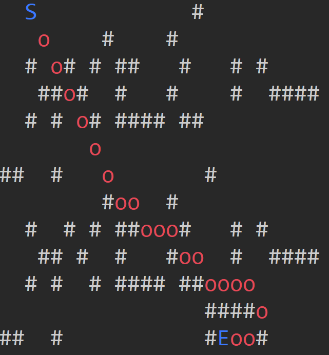

# Pathfinding

Basic implementation of pathfinding algorithms. Including:
1. [Dijkstra](https://en.wikipedia.org/wiki/Dijkstra%27s_algorithm)
2. [A* (A Star)](https://en.wikipedia.org/wiki/A*_search_algorithm)
3. [BFS (Breadth First Search)](https://en.wikipedia.org/wiki/Breadth-first_search)

## Usage

```
0 - Empty
1 - Wall
2 - Start
3 - End
```

**Input as array**

```csharp
var input = new int[,] {
  { 2, 1, 3 },
  { 0, 1, 0 },
  { 0, 0, 0 }
};

var graph = Graph.Create(input);
var aStar = new AStar(graph);
var path = aStar.GetPath();
```

**Input as string**

```csharp
var input = @"213
010
000";

var graph = Graph.Create(input);
var aStar = new AStar(graph);
var path = aStar.GetPath();
```
## Example project


